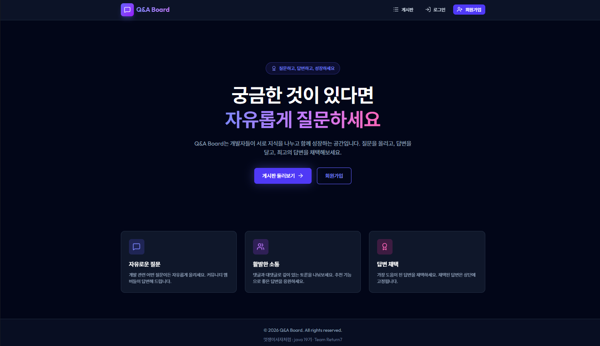

# 📋 Q&A Board

<div align="center">


### 멋쟁이사자처럼 백엔드 부트캠프 19기: Java <br> 팀 기초 프로젝트 @Return7




</div>


- [](https://github.com/corqu)
- [](https://github.com/Jeong-Jae-yun)
- [](https://github.com/Kim-youngjin8645)
- [](https://github.com/star1431)

---

## 1. 프로젝트 정보

### 1.1 프로젝트 개요

Q&A Board는 사용자들이 질문을 올리고 답변을 받을 수 있는 커뮤니티 게시판 서비스입니다.<br>
OAuth2 소셜 로그인, 이메일 인증, 실시간 댓글 및 채택 기능을 제공합니다.


### 1.2 개발 기간

- 2025-12-22 ~ 2026-01-06

### 1.3 주요 기능

- **소셜 로그인**: Google, Naver, Kakao OAuth2 인증
- **이메일 인증**: 비밀번호 찾기 및 재설정 기능
- **Q&A 게시판**: 질문 작성, 답변, 댓글 기능
- **답변 채택**: 질문자에게 유용한 답변 채택 기능
- **사용자 관리**: 마이페이지, 닉네임 설정
- **관리자 기능**: 게시글 및 댓글 관리, 사용자 관리

---

## 2. 기술 스택

### Backend

- **Java** 21
- **Spring Boot** 3.5.9
- **Spring Security**
- **Spring OAuth2 Client**
- **Spring Data JPA**
- **MySQL** 8.0
- **Spring Mail**

### Frontend

- **Next.js** 16.1.1
- **React** 19.2.3
- **Axios** 1.13.2
- **TanStack Query** 5.90.15
- **Tailwind CSS** 4
- **Lucide React**


### Infrastructure

- **Docker**
- **Docker Compose**
- **Nginx**
- **GitHub Actions**

---

## 3. 프로젝트 구조

```
boardproject/
    ├── .github/                    # GitHub
    │   └── workflows/
    │       └── cicd.yml
    │           
    ├── board-backend/              # Spring Boot 백엔드
    │   ├── src/
    │   │   ├── main/
    │   │   │   ├── java/           
    │   │   │   └── resources/      
    │   │   └── test/               
    │   ├── Dockerfile             
    │   ├── build.gradle           
    │   └── README.md
    │ 
    ├── board-frontend/             # Next.js 프론트엔드
    │   ├── src/
    │   │   ├── app/                
    │   │   ├── components/        
    │   │   ├── api/                
    │   │   ├── hooks/             
    │   │   └── lib/                
    │   ├── Dockerfile             
    │   ├── package.json
    │   └── README.md
    │ 
    ├── nginx/                      # Nginx 설정 파일
    │   ├── nginx.conf              
    │   └── local.conf              
    │ 
    ├── docs/                       # 프로젝트 문서 모음
    │   └── images/
    │ 
    ├── docker-compose.yml          # Docker Compose 설정
    │
    └── README.md
```


## 4. 프로젝트 문서

프로젝트 관련 상세 문서는 `docs/` 폴더에서 참고 바랍니다 :

- 🔀 [시스템 흐름 정보](./docs/01-project-run.md)
- 🚩 [프로젝트 실행](./docs/01-project-run.md)
- 📡 [API 명세서](./docs/02-api-specification.md)
- ☁️ [AWS 배포](./docs/03-deploy.md)
- 🔄 [CI/CD 자동화](./docs/04-cicd.md)
- 📐 [프로젝트 버전 정보](./docs/05-project-version.md)


백엔드 프론트 관련 정보는 각 폴더의 `README.md` 파일에서 참고 바랍니다 :

- 🖥️ [Board Backend](./board-backend/README.md)
- 🖥️ [Board Frontend](./board-frontend/README.md)

---

