# Q&A Board - DB-BE-FE Flow 정보

## 목차

1. [프론트엔드 URL 구조](#0-프론트엔드-url-구조)
2. [유저 흐름](#1-유저-흐름)
3. [게시글 흐름](#2-게시글-흐름)
4. [댓글 흐름](#3-댓글-흐름)

---

## 0. 프론트엔드 URL 구조

### 0.1 인증 관련 페이지

| URL | 설명 | 인증 필요 |
|-----|------|----------|
| `/` | 메인 페이지 (게시글 목록) | ❌ |
| `/login` | 로그인 페이지 | ❌ |
| `/signup` | 회원가입 페이지 | ❌ |
| `/oauth-edit` | OAuth 로그인 후 닉네임 설정 | ✅ |
| `/forgot-password` | 비밀번호 찾기 요청 | ❌ |
| `/reset-password` | 비밀번호 재설정 | ❌ |
| `/mypage` | 마이페이지 | ✅ |

### 0.2 게시글 관련 페이지

| URL | 설명 | 인증 필요 |
|-----|------|----------|
| `/boards` | 게시글 목록 | ❌ |
| `/boards/new` | 게시글 작성 | ✅ |
| `/boards/[id]` | 게시글 상세 | ❌ |
| `/boards/[id]/edit` | 게시글 수정 | ✅ |

### 0.3 관리자 페이지

| URL | 설명 | 인증 필요 |
|-----|------|----------|
| `/admin` | 관리자 페이지 | ✅ (ADMIN) |

---

## 1. 유저 흐름

### 1.1 회원가입

**프론트엔드 URL**: `/signup`

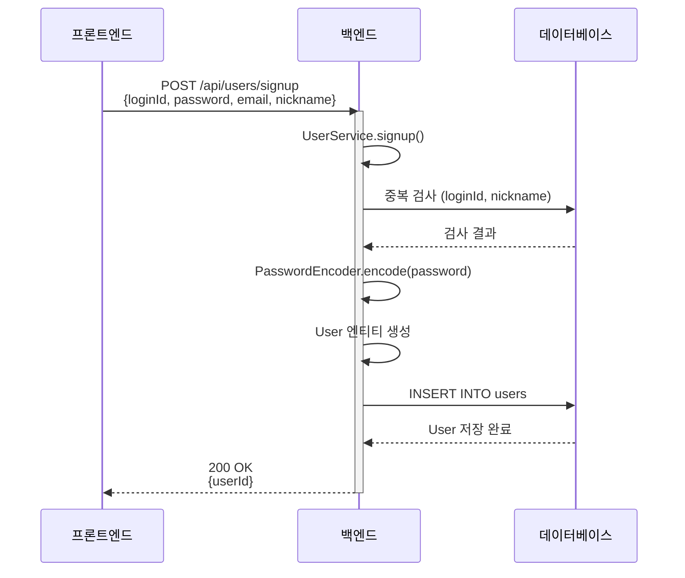
```mermaid
sequenceDiagram
    participant FE as 프론트엔드
    participant BE as 백엔드
    participant DB as 데이터베이스

    FE->>BE: POST /api/users/signup<br/>{loginId, password, email, nickname}
    activate BE
    BE->>BE: UserService.signup()
    BE->>DB: 중복 검사 (loginId, nickname)
    DB-->>BE: 검사 결과
    BE->>BE: PasswordEncoder.encode(password)
    BE->>BE: User 엔티티 생성
    BE->>DB: INSERT INTO users
    DB-->>BE: User 저장 완료
    BE-->>FE: 200 OK<br/>{userId}
    deactivate BE
```

**주요 처리 사항:**
- 비밀번호 암호화 (BCrypt)
- 로그인 ID 중복 검사
- 닉네임 중복 검사
- 이메일 유효성 검증

---

### 1.2 로그인 (Form Login)

**프론트엔드 URL**: `/login`

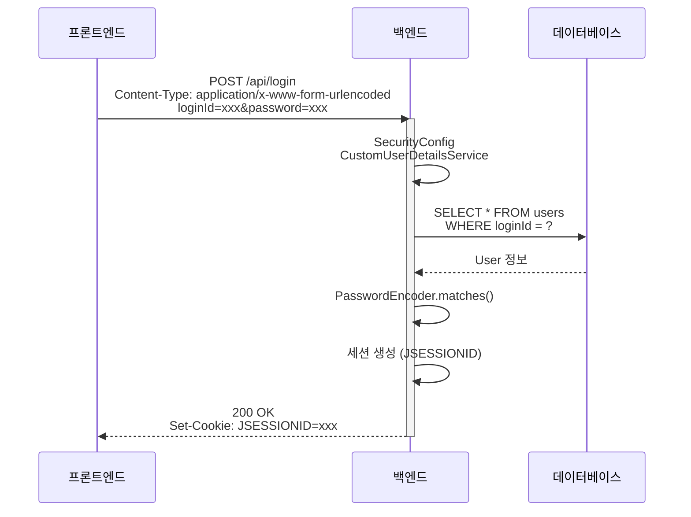
```mermaid
sequenceDiagram
    participant FE as 프론트엔드
    participant BE as 백엔드
    participant DB as 데이터베이스

    FE->>BE: POST /api/login<br/>Content-Type: application/x-www-form-urlencoded<br/>loginId=xxx&password=xxx
    activate BE
    BE->>BE: SecurityConfig<br/>CustomUserDetailsService
    BE->>DB: SELECT * FROM users<br/>WHERE loginId = ?
    DB-->>BE: User 정보
    BE->>BE: PasswordEncoder.matches()
    BE->>BE: 세션 생성 (JSESSIONID)
    BE-->>FE: 200 OK<br/>Set-Cookie: JSESSIONID=xxx
    deactivate BE
```

**주요 처리 사항:**
- Spring Security Form Login 사용
- 세션 기반 인증 (JSESSIONID 쿠키)
- 비밀번호 검증 (BCrypt)

---

### 1.3 OAuth2 소셜 로그인

**프론트엔드 URL**: `/login` (OAuth 버튼 클릭 시)

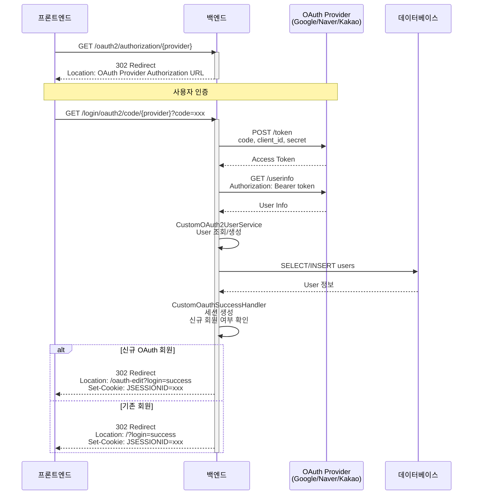
```mermaid
sequenceDiagram
    participant FE as 프론트엔드
    participant BE as 백엔드
    participant OAuth as OAuth Provider<br/>(Google/Naver/Kakao)
    participant DB as 데이터베이스

    FE->>BE: GET /oauth2/authorization/{provider}
    activate BE
    BE-->>FE: 302 Redirect<br/>Location: OAuth Provider Authorization URL
    deactivate BE
    
    Note over FE,OAuth: 사용자 인증
    
    FE->>BE: GET /login/oauth2/code/{provider}?code=xxx
    activate BE
    BE->>OAuth: POST /token<br/>code, client_id, secret
    OAuth-->>BE: Access Token
    BE->>OAuth: GET /userinfo<br/>Authorization: Bearer token
    OAuth-->>BE: User Info
    BE->>BE: CustomOAuth2UserService<br/>User 조회/생성
    BE->>DB: SELECT/INSERT users
    DB-->>BE: User 정보
    BE->>BE: CustomOauthSuccessHandler<br/>세션 생성<br/>신규 회원 여부 확인
    
    alt 신규 OAuth 회원
        BE-->>FE: 302 Redirect<br/>Location: /oauth-edit?login=success<br/>Set-Cookie: JSESSIONID=xxx
    else 기존 회원
        BE-->>FE: 302 Redirect<br/>Location: /?login=success<br/>Set-Cookie: JSESSIONID=xxx
    end
    deactivate BE
```

**지원하는 OAuth Provider:**
- Google
- Naver
- Kakao

**주요 처리 사항:**
- OAuth2 Authorization Code Flow 사용
- 사용자 정보 자동 조회/생성
- 신규 OAuth 회원인 경우 `/oauth-edit`로 리다이렉트 (닉네임 설정)

---

### 1.4 내 정보 조회

**프론트엔드 URL**: `/mypage`

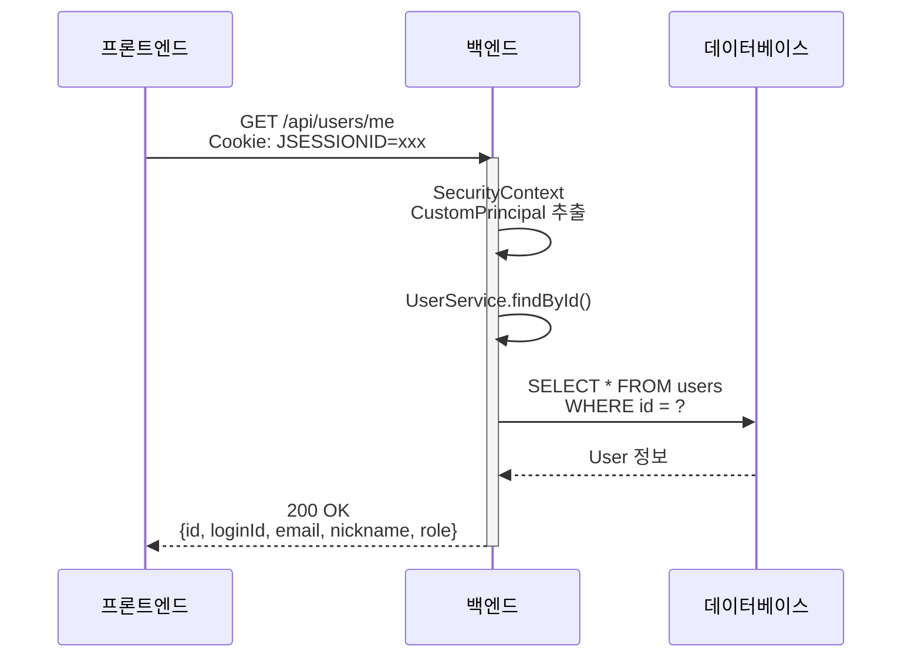
```mermaid
sequenceDiagram
    participant FE as 프론트엔드
    participant BE as 백엔드
    participant DB as 데이터베이스

    FE->>BE: GET /api/users/me<br/>Cookie: JSESSIONID=xxx
    activate BE
    BE->>BE: SecurityContext<br/>CustomPrincipal 추출
    BE->>BE: UserService.findById()
    BE->>DB: SELECT * FROM users<br/>WHERE id = ?
    DB-->>BE: User 정보
    BE-->>FE: 200 OK<br/>{id, loginId, email, nickname, role}
    deactivate BE
```

---

### 1.5 비밀번호 재설정

**프론트엔드 URL**: 
- `/forgot-password` - 비밀번호 찾기 요청
- `/reset-password` - 비밀번호 재설정

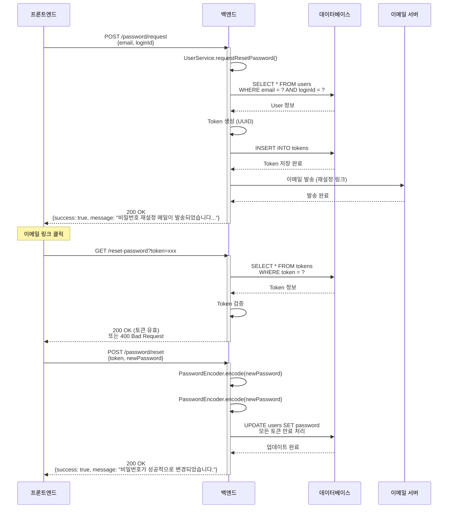
```mermaid
sequenceDiagram
    participant FE as 프론트엔드
    participant BE as 백엔드
    participant DB as 데이터베이스
    participant Email as 이메일 서버

    FE->>BE: POST /password/request<br/>{email, loginId}
    activate BE
    BE->>BE: UserService.requestResetPassword()
    BE->>DB: SELECT * FROM users<br/>WHERE email = ? AND loginId = ?
    DB-->>BE: User 정보
    BE->>BE: Token 생성 (UUID)
    BE->>DB: INSERT INTO tokens
    DB-->>BE: Token 저장 완료
    BE->>Email: 이메일 발송 (재설정 링크)
    Email-->>BE: 발송 완료
    BE-->>FE: 200 OK<br/>{success: true, message: "비밀번호 재설정 메일이 발송되었습니다..."}
    deactivate BE
    
    Note over FE: 이메일 링크 클릭
    
    FE->>BE: GET /reset-password?token=xxx
    activate BE
    BE->>DB: SELECT * FROM tokens<br/>WHERE token = ?
    DB-->>BE: Token 정보
    BE->>BE: Token 검증
    BE-->>FE: 200 OK (토큰 유효)<br/>또는 400 Bad Request
    deactivate BE
    
    FE->>BE: POST /password/reset<br/>{token, newPassword}
    activate BE
    BE->>BE: PasswordEncoder.encode(newPassword)
    BE->>BE: PasswordEncoder.encode(newPassword)
    BE->>DB: UPDATE users SET password<br/>모든 토큰 만료 처리
    DB-->>BE: 업데이트 완료
    BE-->>FE: 200 OK<br/>{success: true, message: "비밀번호가 성공적으로 변경되었습니다."}
    deactivate BE
```

---

## 2. 게시글 흐름

### 2.1 게시글 작성

**프론트엔드 URL**: `/boards/new`

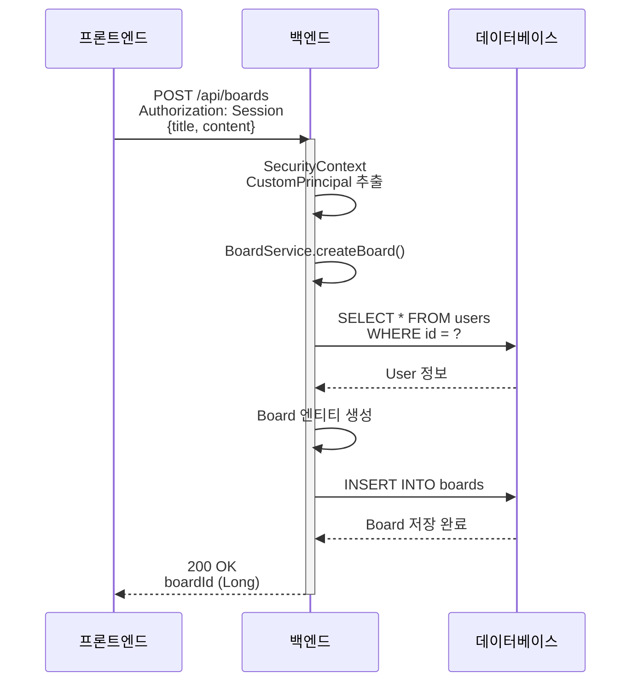
```mermaid
sequenceDiagram
    participant FE as 프론트엔드
    participant BE as 백엔드
    participant DB as 데이터베이스

    FE->>BE: POST /api/boards<br/>Authorization: Session<br/>{title, content}
    activate BE
    BE->>BE: SecurityContext<br/>CustomPrincipal 추출
    BE->>BE: BoardService.createBoard()
    BE->>DB: SELECT * FROM users<br/>WHERE id = ?
    DB-->>BE: User 정보
    BE->>BE: Board 엔티티 생성
    BE->>DB: INSERT INTO boards
    DB-->>BE: Board 저장 완료
    BE-->>FE: 200 OK<br/>boardId (Long)
    deactivate BE
```

**주요 처리 사항:**
- 로그인 필수 (USER 또는 ADMIN 권한)
- 제목, 내용 유효성 검증
- 작성자 정보 자동 설정

---

### 2.2 게시글 목록 조회

**프론트엔드 URL**: `/boards` 또는 `/`

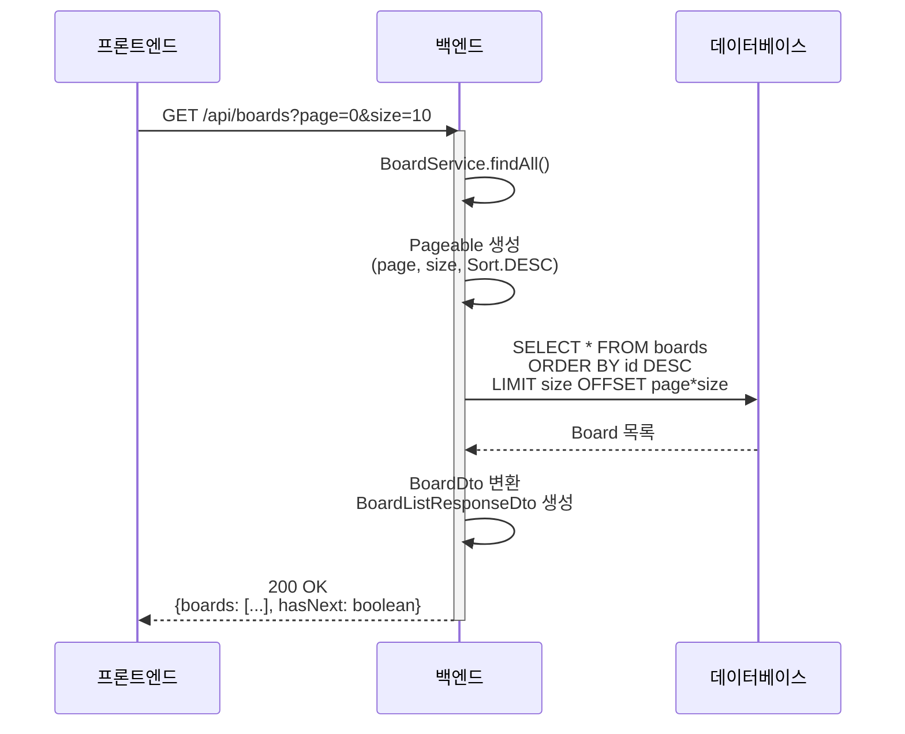
```mermaid
sequenceDiagram
    participant FE as 프론트엔드
    participant BE as 백엔드
    participant DB as 데이터베이스

    FE->>BE: GET /api/boards?page=0&size=10
    activate BE
    BE->>BE: BoardService.findAll()
    BE->>BE: Pageable 생성<br/>(page, size, Sort.DESC)
    BE->>DB: SELECT * FROM boards<br/>ORDER BY id DESC<br/>LIMIT size OFFSET page*size
    DB-->>BE: Board 목록
    BE->>BE: BoardDto 변환<br/>BoardListResponseDto 생성
    BE-->>FE: 200 OK<br/>{boards: [...], hasNext: boolean}
    deactivate BE
```

**주요 처리 사항:**
- 비로그인 사용자도 조회 가능
- 페이지네이션 지원 (기본값: page=0, size=10)
- 내림차순 정렬 (최신순)

### 2.2.1 게시글 검색

**프론트엔드 URL**: `/boards` (검색 기능)

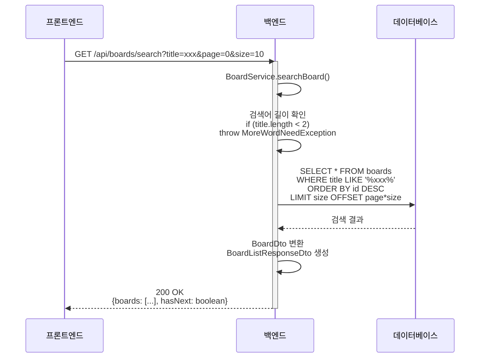
```mermaid
sequenceDiagram
    participant FE as 프론트엔드
    participant BE as 백엔드
    participant DB as 데이터베이스

    FE->>BE: GET /api/boards/search?title=xxx&page=0&size=10
    activate BE
    BE->>BE: BoardService.searchBoard()
    BE->>BE: 검색어 길이 확인<br/>if (title.length < 2)<br/>throw MoreWordNeedException
    BE->>DB: SELECT * FROM boards<br/>WHERE title LIKE '%xxx%'<br/>ORDER BY id DESC<br/>LIMIT size OFFSET page*size
    DB-->>BE: 검색 결과
    BE->>BE: BoardDto 변환<br/>BoardListResponseDto 생성
    BE-->>FE: 200 OK<br/>{boards: [...], hasNext: boolean}
    deactivate BE
```

**주요 처리 사항:**
- 비로그인 사용자도 검색 가능
- 최소 2글자 이상 검색어 필요
- 제목 기준 LIKE 검색

---

### 2.3 게시글 상세 조회

**프론트엔드 URL**: `/boards/[id]`

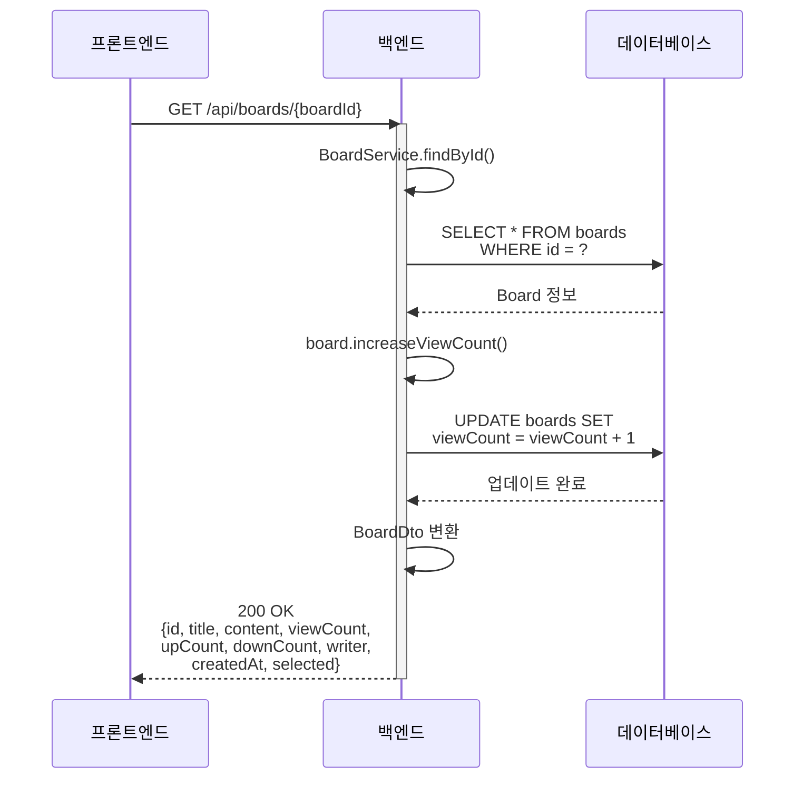
```mermaid
sequenceDiagram
    participant FE as 프론트엔드
    participant BE as 백엔드
    participant DB as 데이터베이스

    FE->>BE: GET /api/boards/{boardId}
    activate BE
    BE->>BE: BoardService.findById()
    BE->>DB: SELECT * FROM boards<br/>WHERE id = ?
    DB-->>BE: Board 정보
    BE->>BE: board.increaseViewCount()
    BE->>DB: UPDATE boards SET<br/>viewCount = viewCount + 1
    DB-->>BE: 업데이트 완료
    BE->>BE: BoardDto 변환
    BE-->>FE: 200 OK<br/>{id, title, content, viewCount,<br/>upCount, downCount, writer,<br/>createdAt, selected}
    deactivate BE
```

**주요 처리 사항:**
- 비로그인 사용자도 조회 가능
- 조회수 자동 증가
- 채택 여부 포함

---

### 2.4 게시글 수정

**프론트엔드 URL**: `/boards/[id]/edit`

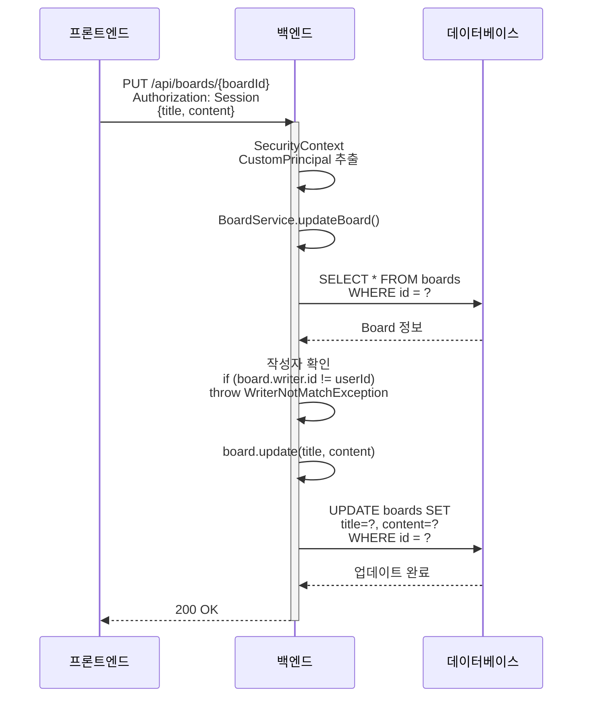
```mermaid
sequenceDiagram
    participant FE as 프론트엔드
    participant BE as 백엔드
    participant DB as 데이터베이스

    FE->>BE: PUT /api/boards/{boardId}<br/>Authorization: Session<br/>{title, content}
    activate BE
    BE->>BE: SecurityContext<br/>CustomPrincipal 추출
    BE->>BE: BoardService.updateBoard()
    BE->>DB: SELECT * FROM boards<br/>WHERE id = ?
    DB-->>BE: Board 정보
    BE->>BE: 작성자 확인<br/>if (board.writer.id != userId)<br/>throw WriterNotMatchException
    BE->>BE: board.update(title, content)
    BE->>DB: UPDATE boards SET<br/>title=?, content=?<br/>WHERE id = ?
    DB-->>BE: 업데이트 완료
    BE-->>FE: 200 OK
    deactivate BE
```

**주요 처리 사항:**
- 작성자만 수정 가능
- 관리자는 수정 불가 (삭제만 가능)

---

### 2.5 게시글 삭제

**프론트엔드 URL**: `/boards/[id]` (상세 페이지에서 삭제 버튼)

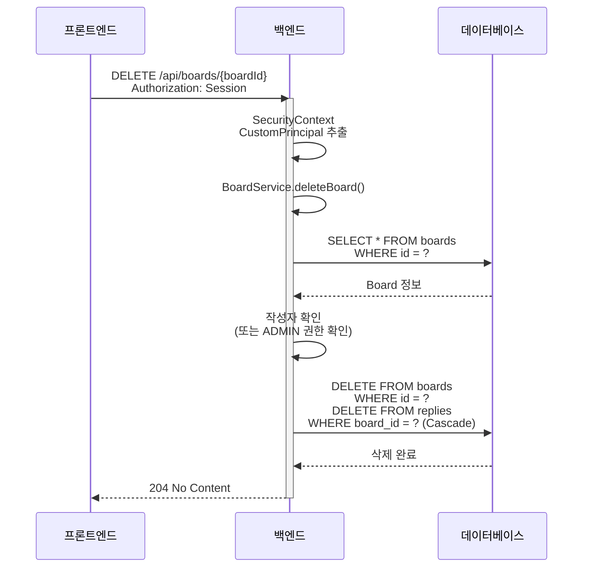
```mermaid
sequenceDiagram
    participant FE as 프론트엔드
    participant BE as 백엔드
    participant DB as 데이터베이스

    FE->>BE: DELETE /api/boards/{boardId}<br/>Authorization: Session
    activate BE
    BE->>BE: SecurityContext<br/>CustomPrincipal 추출
    BE->>BE: BoardService.deleteBoard()
    BE->>DB: SELECT * FROM boards<br/>WHERE id = ?
    DB-->>BE: Board 정보
    BE->>BE: 작성자 확인<br/>(또는 ADMIN 권한 확인)
    BE->>DB: DELETE FROM boards<br/>WHERE id = ?<br/>DELETE FROM replies<br/>WHERE board_id = ? (Cascade)
    DB-->>BE: 삭제 완료
    BE-->>FE: 204 No Content
    deactivate BE
```

**주요 처리 사항:**
- 작성자 또는 관리자만 삭제 가능
- Cascade로 연관된 댓글도 함께 삭제

---

### 2.6 게시글 추천/비추천

**프론트엔드 URL**: `/boards/[id]` (상세 페이지에서 추천/비추천 버튼)

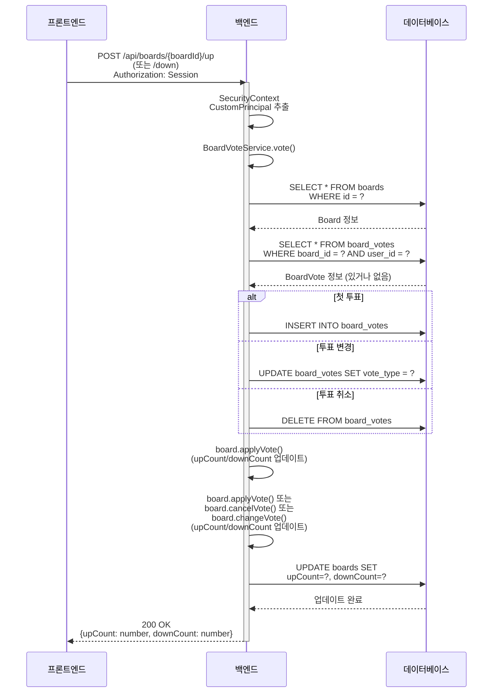
```mermaid
sequenceDiagram
    participant FE as 프론트엔드
    participant BE as 백엔드
    participant DB as 데이터베이스

    FE->>BE: POST /api/boards/{boardId}/up<br/>(또는 /down)<br/>Authorization: Session
    activate BE
    BE->>BE: SecurityContext<br/>CustomPrincipal 추출
    BE->>BE: BoardVoteService.vote()
    BE->>DB: SELECT * FROM boards<br/>WHERE id = ?
    DB-->>BE: Board 정보
    BE->>DB: SELECT * FROM board_votes<br/>WHERE board_id = ? AND user_id = ?
    DB-->>BE: BoardVote 정보 (있거나 없음)
    
    alt 첫 투표
        BE->>DB: INSERT INTO board_votes
    else 투표 변경
        BE->>DB: UPDATE board_votes SET vote_type = ?
    else 투표 취소
        BE->>DB: DELETE FROM board_votes
    end
    
    BE->>BE: board.applyVote()<br/>(upCount/downCount 업데이트)
    BE->>BE: board.applyVote() 또는<br/>board.cancelVote() 또는<br/>board.changeVote()<br/>(upCount/downCount 업데이트)
    BE->>DB: UPDATE boards SET<br/>upCount=?, downCount=?
    DB-->>BE: 업데이트 완료
    BE-->>FE: 200 OK<br/>{upCount: number, downCount: number}
    deactivate BE
```

**주요 처리 사항:**
- 사용자당 한 번만 투표 가능
- 같은 버튼 다시 클릭 시 취소
- 추천 ↔ 비추천 변경 가능
- 응답: {upCount, downCount} Map
- 실시간 카운트 업데이트

---

## 3. 댓글 흐름

### 3.1 댓글 작성

**프론트엔드 URL**: `/boards/[id]` (상세 페이지 하단 댓글 작성 영역)

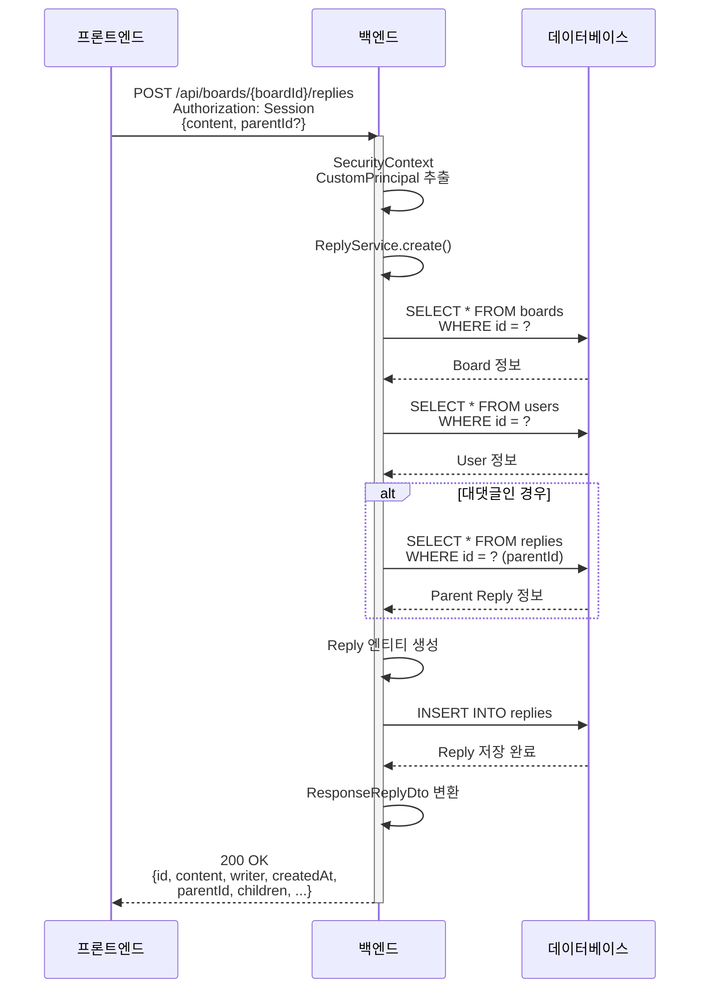
```mermaid
sequenceDiagram
    participant FE as 프론트엔드
    participant BE as 백엔드
    participant DB as 데이터베이스

    FE->>BE: POST /api/boards/{boardId}/replies<br/>Authorization: Session<br/>{content, parentId?}
    activate BE
    BE->>BE: SecurityContext<br/>CustomPrincipal 추출
    BE->>BE: ReplyService.create()
    BE->>DB: SELECT * FROM boards<br/>WHERE id = ?
    DB-->>BE: Board 정보
    BE->>DB: SELECT * FROM users<br/>WHERE id = ?
    DB-->>BE: User 정보
    
    alt 대댓글인 경우
        BE->>DB: SELECT * FROM replies<br/>WHERE id = ? (parentId)
        DB-->>BE: Parent Reply 정보
    end
    
    BE->>BE: Reply 엔티티 생성
    BE->>DB: INSERT INTO replies
    DB-->>BE: Reply 저장 완료
    BE->>BE: ResponseReplyDto 변환
    BE-->>FE: 200 OK<br/>{id, content, writer, createdAt,<br/>parentId, children, ...}
    deactivate BE
```

**주요 처리 사항:**
- 로그인 필수
- 대댓글 지원 (parentId로 계층 구조)
- 게시글 존재 여부 확인

---

### 3.2 댓글 목록 조회

**프론트엔드 URL**: `/boards/[id]` (상세 페이지 하단 댓글 목록 영역)

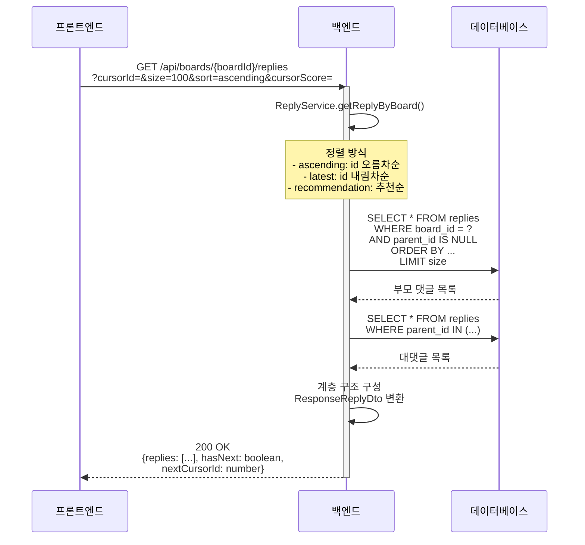
```mermaid
sequenceDiagram
    participant FE as 프론트엔드
    participant BE as 백엔드
    participant DB as 데이터베이스

    FE->>BE: GET /api/boards/{boardId}/replies<br/>?cursorId=&size=100&sort=ascending&cursorScore=
    activate BE
    BE->>BE: ReplyService.getReplyByBoard()
    
    Note over BE: 정렬 방식<br/>- ascending: id 오름차순<br/>- latest: id 내림차순<br/>- recommendation: 추천순
    
    BE->>DB: SELECT * FROM replies<br/>WHERE board_id = ?<br/>AND parent_id IS NULL<br/>ORDER BY ...<br/>LIMIT size
    DB-->>BE: 부모 댓글 목록
    BE->>DB: SELECT * FROM replies<br/>WHERE parent_id IN (...)
    DB-->>BE: 대댓글 목록
    BE->>BE: 계층 구조 구성<br/>ResponseReplyDto 변환
    BE-->>FE: 200 OK<br/>{replies: [...], hasNext: boolean,<br/>nextCursorId: number}
    deactivate BE
```

**주요 처리 사항:**
- 비로그인 사용자도 조회 가능
- 커서 기반 페이지네이션 (기본 size=100)
- 계층 구조 지원 (대댓글)
- 정렬 옵션: ascending (기본값, 오름차순), latest (내림차순), recommendation (추천순)
- 추천순 정렬 시 cursorScore 파라미터 사용

---

### 3.3 댓글 수정

**프론트엔드 URL**: `/boards/[id]` (댓글 항목의 수정 버튼)

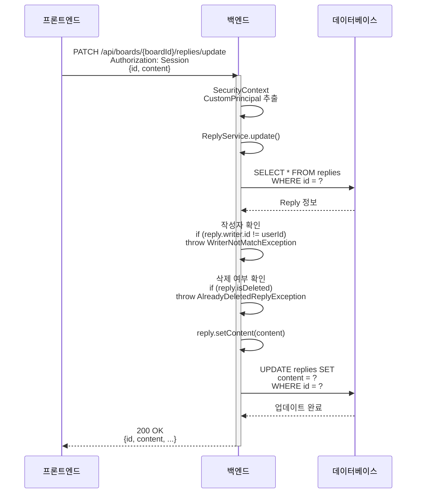
```mermaid
sequenceDiagram
    participant FE as 프론트엔드
    participant BE as 백엔드
    participant DB as 데이터베이스

    FE->>BE: PATCH /api/boards/{boardId}/replies/update<br/>Authorization: Session<br/>{id, content}
    activate BE
    BE->>BE: SecurityContext<br/>CustomPrincipal 추출
    BE->>BE: ReplyService.update()
    BE->>DB: SELECT * FROM replies<br/>WHERE id = ?
    DB-->>BE: Reply 정보
    BE->>BE: 작성자 확인<br/>if (reply.writer.id != userId)<br/>throw WriterNotMatchException
    BE->>BE: 삭제 여부 확인<br/>if (reply.isDeleted)<br/>throw AlreadyDeletedReplyException
    BE->>BE: reply.setContent(content)
    BE->>DB: UPDATE replies SET<br/>content = ?<br/>WHERE id = ?
    DB-->>BE: 업데이트 완료
    BE-->>FE: 200 OK<br/>{id, content, ...}
    deactivate BE
```

**주요 처리 사항:**
- 작성자만 수정 가능
- 삭제된 댓글은 수정 불가

---

### 3.4 댓글 삭제

**프론트엔드 URL**: `/boards/[id]` (댓글 항목의 삭제 버튼)

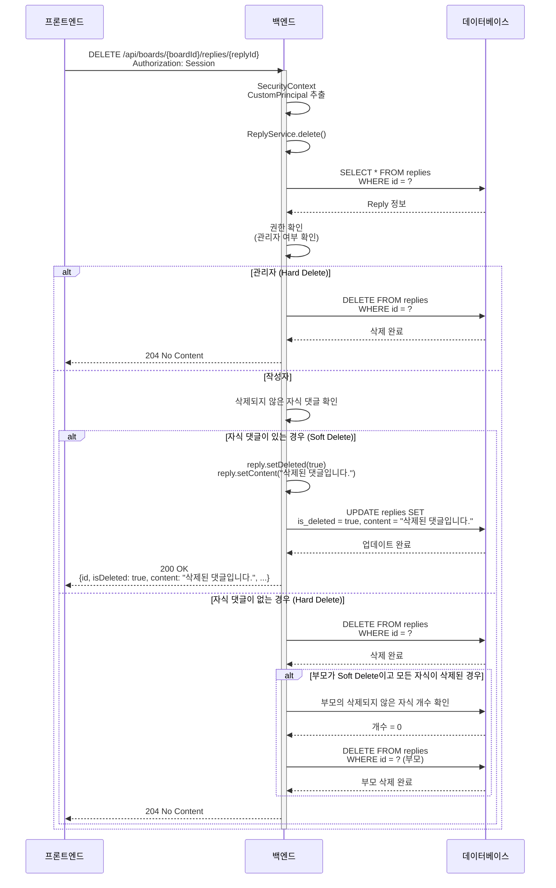
```mermaid
sequenceDiagram
    participant FE as 프론트엔드
    participant BE as 백엔드
    participant DB as 데이터베이스

    FE->>BE: DELETE /api/boards/{boardId}/replies/{replyId}<br/>Authorization: Session
    activate BE
    BE->>BE: SecurityContext<br/>CustomPrincipal 추출
    BE->>BE: ReplyService.delete()
    BE->>DB: SELECT * FROM replies<br/>WHERE id = ?
    DB-->>BE: Reply 정보
    BE->>BE: 권한 확인<br/>(관리자 여부 확인)
    
    alt 관리자 (Hard Delete)
        BE->>DB: DELETE FROM replies<br/>WHERE id = ?
        DB-->>BE: 삭제 완료
        BE-->>FE: 204 No Content
    else 작성자
        BE->>BE: 삭제되지 않은 자식 댓글 확인
        
        alt 자식 댓글이 있는 경우 (Soft Delete)
            BE->>BE: reply.setDeleted(true)<br/>reply.setContent("삭제된 댓글입니다.")
            BE->>DB: UPDATE replies SET<br/>is_deleted = true, content = "삭제된 댓글입니다."
            DB-->>BE: 업데이트 완료
            BE-->>FE: 200 OK<br/>{id, isDeleted: true, content: "삭제된 댓글입니다.", ...}
        else 자식 댓글이 없는 경우 (Hard Delete)
            BE->>DB: DELETE FROM replies<br/>WHERE id = ?
            DB-->>BE: 삭제 완료
            
            alt 부모가 Soft Delete이고 모든 자식이 삭제된 경우
                BE->>DB: 부모의 삭제되지 않은 자식 개수 확인
                DB-->>BE: 개수 = 0
                BE->>DB: DELETE FROM replies<br/>WHERE id = ? (부모)
                DB-->>BE: 부모 삭제 완료
            end
            
            BE-->>FE: 204 No Content
        end
    end
    deactivate BE
```

**주요 처리 사항:**
- 관리자: 항상 Hard Delete (완전 삭제)
- 작성자: 자식 댓글이 있으면 Soft Delete, 없으면 Hard Delete
- Soft Delete 시 content를 "삭제된 댓글입니다."로 변경
- Hard Delete 시 부모가 Soft Delete이고 모든 자식이 삭제되면 부모도 자동 Hard Delete

---

### 3.5 댓글 채택

**프론트엔드 URL**: `/boards/[id]` (댓글 항목의 채택 버튼, 게시글 작성자만 표시)

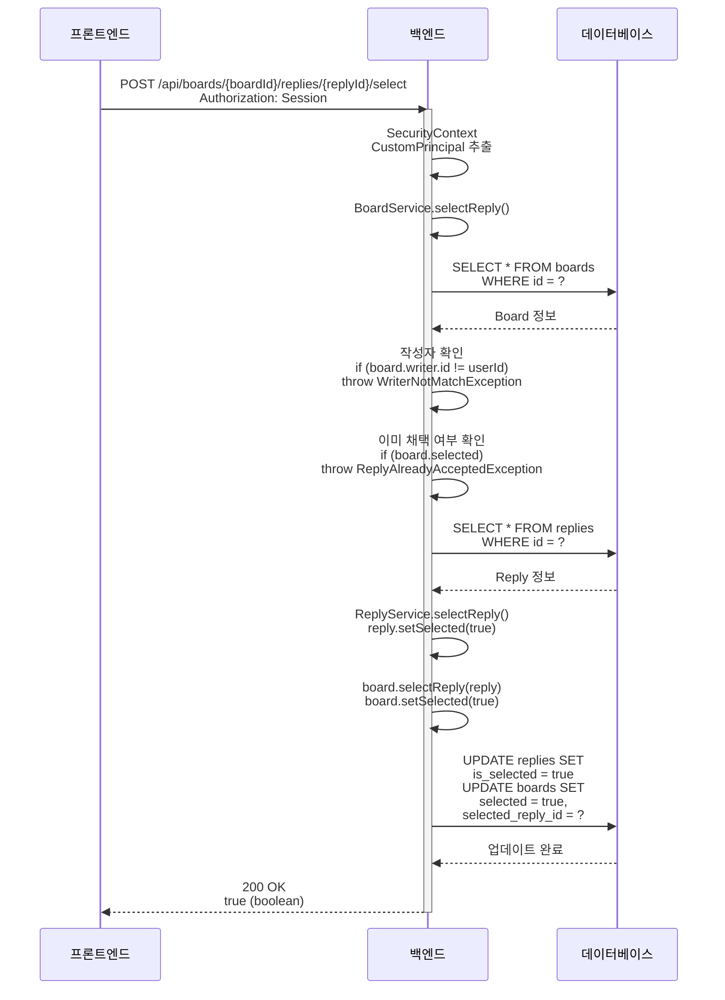
```mermaid
sequenceDiagram
    participant FE as 프론트엔드
    participant BE as 백엔드
    participant DB as 데이터베이스

    FE->>BE: POST /api/boards/{boardId}/replies/{replyId}/select<br/>Authorization: Session
    activate BE
    BE->>BE: SecurityContext<br/>CustomPrincipal 추출
    BE->>BE: BoardService.selectReply()
    BE->>DB: SELECT * FROM boards<br/>WHERE id = ?
    DB-->>BE: Board 정보
    BE->>BE: 작성자 확인<br/>if (board.writer.id != userId)<br/>throw WriterNotMatchException
    BE->>BE: 이미 채택 여부 확인<br/>if (board.selected)<br/>throw ReplyAlreadyAcceptedException
    BE->>DB: SELECT * FROM replies<br/>WHERE id = ?
    DB-->>BE: Reply 정보
    BE->>BE: ReplyService.selectReply()<br/>reply.setSelected(true)
    BE->>BE: board.selectReply(reply)<br/>board.setSelected(true)
    BE->>DB: UPDATE replies SET<br/>is_selected = true<br/>UPDATE boards SET<br/>selected = true,<br/>selected_reply_id = ?
    DB-->>BE: 업데이트 완료
    BE-->>FE: 200 OK<br/>true (boolean)
    deactivate BE
```

**주요 처리 사항:**
- 게시글 작성자만 채택 가능
- 게시글당 하나의 댓글만 채택 가능
- 채택 취소 불가

---

### 3.6 댓글 추천/비추천

**프론트엔드 URL**: `/boards/[id]` (댓글 항목의 추천/비추천 버튼)

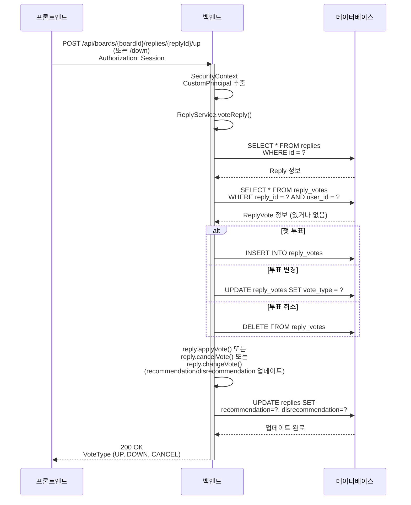
```mermaid
sequenceDiagram
    participant FE as 프론트엔드
    participant BE as 백엔드
    participant DB as 데이터베이스

    FE->>BE: POST /api/boards/{boardId}/replies/{replyId}/up<br/>(또는 /down)<br/>Authorization: Session
    activate BE
    BE->>BE: SecurityContext<br/>CustomPrincipal 추출
    BE->>BE: ReplyService.voteReply()
    BE->>DB: SELECT * FROM replies<br/>WHERE id = ?
    DB-->>BE: Reply 정보
    BE->>DB: SELECT * FROM reply_votes<br/>WHERE reply_id = ? AND user_id = ?
    DB-->>BE: ReplyVote 정보 (있거나 없음)
    
    alt 첫 투표
        BE->>DB: INSERT INTO reply_votes
    else 투표 변경
        BE->>DB: UPDATE reply_votes SET vote_type = ?
    else 투표 취소
        BE->>DB: DELETE FROM reply_votes
    end
    
    BE->>BE: reply.applyVote() 또는<br/>reply.cancelVote() 또는<br/>reply.changeVote()<br/>(recommendation/disrecommendation 업데이트)
    BE->>DB: UPDATE replies SET<br/>recommendation=?, disrecommendation=?
    DB-->>BE: 업데이트 완료
    BE-->>FE: 200 OK<br/>VoteType (UP, DOWN, CANCEL)
    deactivate BE
```

**주요 처리 사항:**
- 사용자당 한 번만 투표 가능
- 같은 버튼 다시 클릭 시 취소 (CANCEL 반환)
- 추천 ↔ 비추천 변경 가능
- 응답: VoteType (UP, DOWN, CANCEL)
- 추천순 정렬에 사용

### 3.7 관리자 댓글 정리

**프론트엔드 URL**: `/boards/[id]` (관리자 전용)

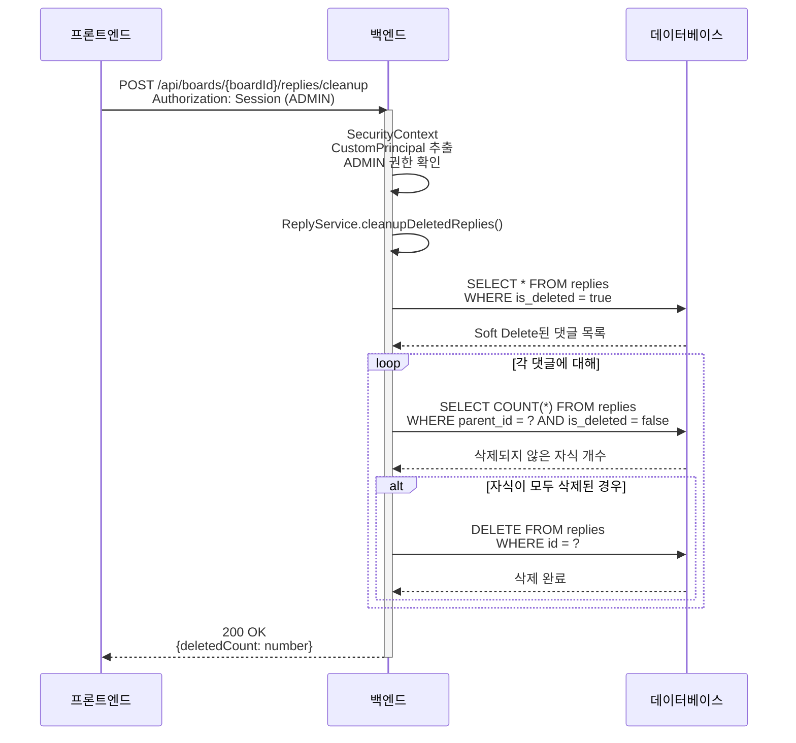
```mermaid
sequenceDiagram
    participant FE as 프론트엔드
    participant BE as 백엔드
    participant DB as 데이터베이스

    FE->>BE: POST /api/boards/{boardId}/replies/cleanup<br/>Authorization: Session (ADMIN)
    activate BE
    BE->>BE: SecurityContext<br/>CustomPrincipal 추출<br/>ADMIN 권한 확인
    BE->>BE: ReplyService.cleanupDeletedReplies()
    BE->>DB: SELECT * FROM replies<br/>WHERE is_deleted = true
    DB-->>BE: Soft Delete된 댓글 목록
    
    loop 각 댓글에 대해
        BE->>DB: SELECT COUNT(*) FROM replies<br/>WHERE parent_id = ? AND is_deleted = false
        DB-->>BE: 삭제되지 않은 자식 개수
        
        alt 자식이 모두 삭제된 경우
            BE->>DB: DELETE FROM replies<br/>WHERE id = ?
            DB-->>BE: 삭제 완료
        end
    end
    
    BE-->>FE: 200 OK<br/>{deletedCount: number}
    deactivate BE
```

**주요 처리 사항:**
- 관리자 전용 기능
- Soft Delete된 댓글 중 자식이 모두 삭제된 댓글을 완전히 삭제
- 데이터 정리용 기능

---

## 4. 인증 및 권한 관리

### 4.1 세션 관리

- **인증 방식**: Spring Security Session 기반
- **세션 저장소**: 메모리 (서버 재시작 시 초기화)
- **쿠키**: JSESSIONID (HttpOnly, SameSite)
- **세션 만료**: 기본 30분 (비활성화 시)

### 4.2 권한 체계

```
비로그인 사용자
├── 게시글 조회 (GET /api/boards/**)
├── 댓글 조회 (GET /api/boards/*/replies)
└── 회원가입 (POST /api/users/signup)

USER 권한
├── 게시글 작성/수정/삭제 (본인 게시글만)
├── 댓글 작성/수정/삭제 (본인 댓글만)
├── 게시글/댓글 추천/비추천
├── 댓글 채택 (본인 게시글만)
└── 마이페이지 관리

ADMIN 권한
├── 모든 USER 권한
├── 모든 게시글 삭제
├── 모든 댓글 삭제 (Hard Delete)
└── 사용자 관리
```

---

## 5. 데이터베이스 관계

### 5.1 엔티티 관계도

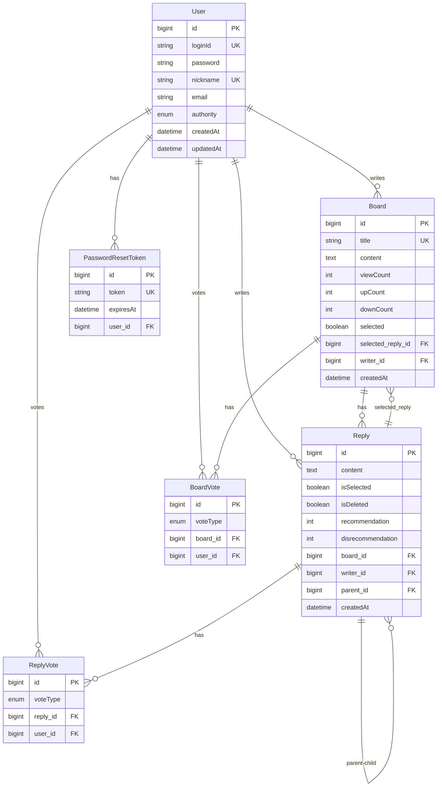
```mermaid
erDiagram
    User ||--o{ Board : writes
    User ||--o{ Reply : writes
    User ||--o{ BoardVote : votes
    User ||--o{ ReplyVote : votes
    User ||--o{ PasswordResetToken : has
    
    Board ||--o{ Reply : has
    Board ||--o{ BoardVote : has
    Board }o--|| Reply : "selected_reply"
    
    Reply ||--o{ Reply : "parent-child"
    Reply ||--o{ ReplyVote : has
    
    User {
        bigint id PK
        string loginId UK
        string password
        string nickname UK
        string email
        enum authority
        datetime createdAt
        datetime updatedAt
    }
    
    Board {
        bigint id PK
        string title UK
        text content
        int viewCount
        int upCount
        int downCount
        boolean selected
        bigint selected_reply_id FK
        bigint writer_id FK
        datetime createdAt
    }
    
    Reply {
        bigint id PK
        text content
        boolean isSelected
        boolean isDeleted
        int recommendation
        int disrecommendation
        bigint board_id FK
        bigint writer_id FK
        bigint parent_id FK
        datetime createdAt
    }
    
    BoardVote {
        bigint id PK
        enum voteType
        bigint board_id FK
        bigint user_id FK
    }
    
    ReplyVote {
        bigint id PK
        enum voteType
        bigint reply_id FK
        bigint user_id FK
    }
    
    PasswordResetToken {
        bigint id PK
        string token UK
        datetime expiresAt
        bigint user_id FK
    }
```

### 5.2 주요 제약사항

- **게시글**: 작성자 삭제 시 게시글은 유지 (writer nullable)
- **댓글**: 게시글 삭제 시 CASCADE로 함께 삭제
- **대댓글**: 부모 댓글 삭제 시 CASCADE로 함께 삭제
- **투표**: 사용자당 게시글/댓글당 하나만 가능 (복합 유니크)

---

## 6. 에러 처리

### 6.1 주요 예외

- `UserNotFoundException`: 사용자를 찾을 수 없음
- `BoardNotFoundException`: 게시글을 찾을 수 없음
- `ReplyNotFoundException`: 댓글을 찾을 수 없음
- `WriterNotMatchException`: 작성자가 일치하지 않음
- `ReplyAlreadyAcceptedException`: 이미 채택된 댓글
- `AlreadyDeletedReplyException`: 이미 삭제된 댓글
- `NoAuthorityException`: 권한 없음

### 6.2 에러 응답 형식

```json
{
  "error": "에러 메시지",
  "status": 400,
  "timestamp": "2026-01-06T10:00:00"
}
```

---

## 7. 성능 최적화

### 7.1 페이지네이션

- **게시글**: Offset 기반 페이지네이션
- **댓글**: 커서 기반 페이지네이션 (대용량 데이터 대응)

### 7.2 지연 로딩

- **JPA FetchType.LAZY**: 연관 엔티티 지연 로딩
- **N+1 문제 방지**: 필요 시 Fetch Join 사용

### 7.3 캐싱

- 현재 미적용 (향후 Redis 도입 검토)

---

## 8. 보안 고려사항

### 8.1 인증 보안

- 비밀번호 BCrypt 암호화
- 세션 하이재킹 방지 (HttpOnly 쿠키)
- CSRF 보호 (프론트엔드와 협의하여 비활성화)

### 8.2 입력 검증

- Spring Validation 사용
- SQL Injection 방지 (JPA 사용)
- XSS 방지 (프론트엔드 처리)

### 8.3 권한 검증

- 모든 수정/삭제 작업에서 작성자 확인
- 관리자 권한 별도 검증
